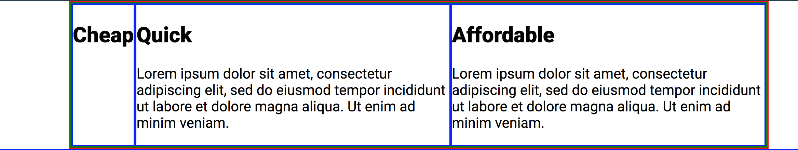
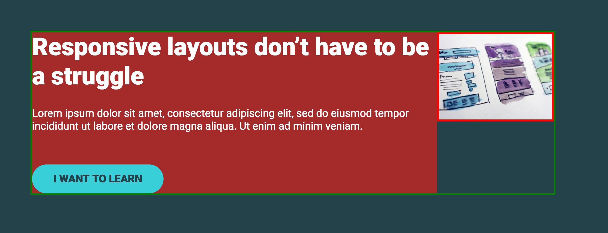
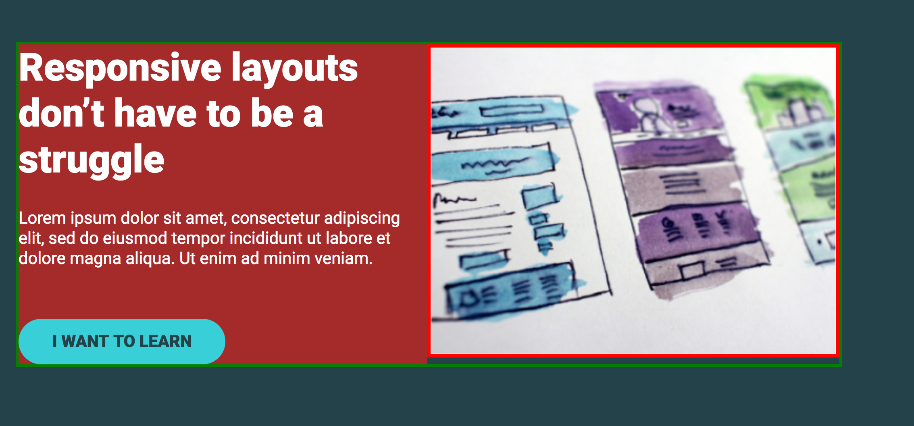
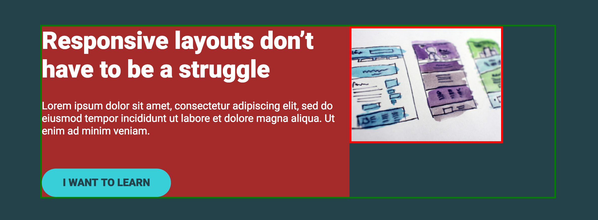
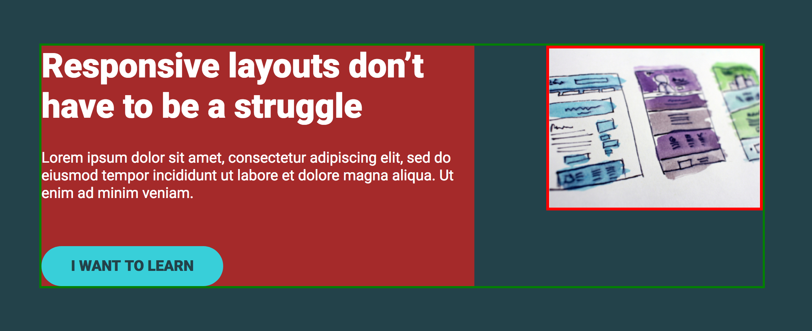

# conquering-responsive-layouts

> Challenge solutions and Notes on [Kevin
> Powell's](https://www.kevinpowell.co/) course [Conquering Responsive
> Layouts](https://courses.kevinpowell.co/courses/conquering-responsive-layouts)

## Using percentages & avoiding heights

- Layouts are responsive by default. A website without CSS is responsive. It's us who ruin the responsiveness of the web.
- Work in percentages for widths.
- Percentage width of an element is always relative to its parent.
- Avoid setting heights.
- If you need more background use `padding`.

## em vs rem

_TL;DR_: In general, `em` should not be used for `font-size`. Use `rem`,
instead. `rem` is also appropriate to space elements between themselves
(`margin`). `em` gives uses consistent, scalable results. A good use case for
`em` is padding, when we would like to have different size versions of an
element.

YouTube video: https://www.youtube.com/watch?v=_-aDOAMmDHI

Source code: https://codepen.io/kevinpowell/pen/RKdjXe

- Pixels are solid units, they never change.
- `em` and `rem` make our lives much easier when it comes to responsive.
- The whole em unit has its background in the print world, but it the world of web it relates just to font sizes
- For `font-size`, `em` looks at its parent's `font-size`. If `font-size` is not defined, it keeps looking up for it until its found.
- For other properties, `em` looks at **that** element's `font-size`.
- Generally, if `font-size` is not changed, `1em` equals to `16px`.
- With `em` the font sizes compound, they build on each other, so things can get out of control.
- `rem` (root em) was invented to fix the compounding problem. Relates to `html`'s `font-size`.
- `rem` units are more consistent.
- These units can be also used in other properties, such as margins and paddings.
- When `em` is used in properties other than `font-size`, it will look at its own `font-size`.

```css
.col--em h1 {
  font-size: 2.5em;
  margin-bottom: 1em;
}
```

- In the example above, `margin-bottom` will be `2.5em`.
- This does not apply to `rem`. `rem` will **always** look to the root.

```css
.col--em h1 {
  font-size: 2.5em;
  margin-bottom: 1rem;
}
```

- In this case, `margin-bottom` will be `16px` (the font size of the `html` element).

How is this useful? (See video @ 8:10s)

- For example, setting `padding` in a `button`.

```css
.btn {
  padding: 1em 3em;
}
```

- Now imagine we want a small button:

```css
.btn-small {
  font-size: 0.5em;
}
```

```html
<a href="#" class="btn btn-small"></a>
```

- Because we are using `em` the `padding` is automatically adjusting to the `font-size`, keeping everything in the same proportion.
- If it was in `rem`, the `padding` would have not changed, only the `font-size`.
- Its useful to use `em` for this kind of situations, where we want something to be _adaptable_ and _scalable_.
- It's a great way of having consistent elements. Just by creating a new class and setting its `font-size`.
- Now, imagine you'd want consistent spacing (`margin`) between the buttons. In that case it would be more appropriate to use `rem`. It's not going to be relative to the button's `font-size`, so it will always be the same.

- Mind-blowing trick with media queries @ 15:08:

```css
html {
  font-size: 16px;
}
@media (min-width: 700px) {
  html {
    font-size: 25px;
  }
}
```

- Everything gets bigger because at one point both `em`s and `rem`s will reach `html` (careful with the compounding effect). With one media query only, all the `font-size`s can be changed. If `px` was being used, it would not be possible to do this.

## max-width

https://css-tricks.com/tale-width-max-width/

- Helps avoiding horizontal scrolling.
- Very useful for big screen sizes, when we want to limit total line lengths, without having text stretching all the way across.
- Combine `width` (%) and `max-width` (px):

```css
.container {
  width: 80%;
  max-width: 750px;
}
```

- It wants to be 80% of its parent, but it will never get bigger than 750px.
- As `height`, in general, `min-width` should also be avoided. They "fight against something to be responsive".

## CSS Units: vh, vw, vmin, vmax

YouTube video: https://www.youtube.com/watch?v=IWFqGsXxJ1E

Source code: https://codepen.io/kevinpowell/pen/QdRyKe

- `vh` and `vw` stand for viewport height and viewport width.
- `height: 100vh` is useful for full-screen, it sets the height to 100% of the height of its viewport.
- Can cause some problems, in smaller screens. Content can _spill out_ of its container if it doesn't fit. Use some media queries to fix that if needed.
- Percentage widths are relative to the parent element. Viewport widths are not. Can be useful when you want to stretch something outside of its container and take up the entire width of the viewport.

- `vmax` is based on the biggest viewport unit (width and height).
- `vmin` is the other way around, it takes the smallest unit.
- Cool trick is having `padding-top` and `padding-bottom` as `10vh`, for example.
- Setting `font-size` of a title with `vw` can be very useful to make them responsive, instead of media queries that change the `font-size` at different sizes. Maybe only for very small and very big screen sizes.
  Doesn't work so good with paragraph text.
- `8vmin` for the `font-size` of a title is also a really cool trick. While the height is smaller than the width (desktop), it will be in relation to the height; when the width becomes smaller (mobile), it will starto to be in relation the width.

## flexbox

- `display:flex` declares a container as a flex container.
- By default, it says "This item is becoming a row" (The default value of `flex-direction` is `row`). This means all its direct children will be columns.
- `flex-direction` can also have the value `column`. In that case, the item is becoming a column and its direct children rows.
- A child of a flex container is called flex item.
- Flex items try to shrink down to the smallest size they can be. For example, by default a `div` has a width of 100%. However, if that div is a flex item and the `flex-direction` of its parent is `row`, it won't _want_ to take 100% anymore.


```css
.container {
  width: 80%;
  max-width: 1100px;
  margin: 0 auto;
  border: 2px solid red;
}

.row {
  /* display: flex => flex container */
  display: flex;
  border: 2px solid green;
}

.col {
  /* these are now flex items */
}
```

- Now, let's try commenting out the paragraph of the first flex item:



- As we can see, that item only takes the minimum space it needs.
- Flex items, by default, _want_ to be as small as they can be.

- At the same time, their content (the `<p>` element, to be more specific) is trying to take up 100% of the width. If we comment the last two flex items, leaving only the first, we get:


- The paragraph is forcing the flex item to take 100% of the width.
- When the three flex items are present, all their `<p>` elements are trying to take 100% of the width.
- But, since their parent elements are all flex items of the same flex container, they'll have to fit in the same row.

- We've seen what happens when one of the flex items has shorter content.
- If you want to make sure they're all the same size, give them `width: 100%`. Because they all want to be 100%, they'll even out and evenly distribute within that space. 100% is the _ideal_ size that they want to be.

### Spacing flex items

Two ways of doing it:

1. `gap` (as of April 2020 only supported in Firefox)
2. using combinator `+`:

```css
.col + .col {
  margin-left: 20px;
}
```

It targets all the `col` classes that have and adjacent (on top of it in terms of how the HTML is written) `cal` class.

### A deeper dive into flexbox

#### Reducing the amount of HTML and separation of responsibilities in classes

Imagine we have something like this:

```html
<div class="container">
  <div class="row">
    <div class="col">
      <h2>Cheap</h2>
      <p>
        Lorem ipsum dolor sit amet, consectetur adipiscing elit, sed do eiusmod
        tempor incididunt ut labore et dolore magna aliqua. Ut enim ad minim
        veniam.
      </p>
    </div>
    <div class="col">
      <h2>Quick</h2>
      <p>
        Lorem ipsum dolor sit amet, consectetur adipiscing elit, sed do eiusmod
        tempor incididunt ut labore et dolore magna aliqua. Ut enim ad minim
        veniam.
      </p>
    </div>
  </div>
</div>
```

`.container` is setting the `width` and `max-width`. `.row` is just doing `display: flex;`:

```css
.container {
  width: 80%;
  max-width: 1100px;
  margin: 0 auto;
}
.row {
  display: flex;
}
```

If we remove the the `.row` `div` and add the class to its parent:

```html
<div class="container row">
  <div class="col">
    <h2>Cheap</h2>
    <p>
      Lorem ipsum dolor sit amet, consectetur adipiscing elit, sed do eiusmod
      tempor incididunt ut labore et dolore magna aliqua. Ut enim ad minim
      veniam.
    </p>
  </div>
</div>
```

Which gives us the exact same result.
Perhaps now `row` is not the best name for the class anymore. We can change it to something different,
such as `d-flex` (Bootstrap naming), for example.

So now we have a container that's also a flex container:

```html
<div class="container d-flex">
  <div class="col">
    <h2>Cheap</h2>
    <p>
      Lorem ipsum dolor sit amet, consectetur adipiscing elit, sed do eiusmod
      tempor incididunt ut labore et dolore magna aliqua. Ut enim ad minim
      veniam.
    </p>
  </div>
</div>
```

This separation in two classes is important because there may be times when we need a container but don´t want it to be a flex container (to have its content broken down into columns).

#### Image inside flex container

- `display: flex` stretches all its items to be equal in height
- This can cause images that are flex items to loose their aspect ratio
- `align-items: flex-start` in the flex container is one possible solution
- If a flex container's `flex-direction` is `row` => `align-items` will work on the y-axis; If a flex container's `flex-direction` is `column` => `align-items` will work on the x-axis
- However, it's good practice to have the flex container do the least amount of work possible

Another possible solution:

- Wrapping the `img` in a `div`. The `img` won't stretch anymore, the `div` will

Or, a third solution:

- Don't wrap it in `div` but give it this class:

```css
.hero__img {
  align-self: flex-start;
}
```

#### Column widths and flexbox

This is our starting point:

```html
<div class="hero">
  <div class="container row">
    <div class="hero__text">
      <h1>Responsive layouts don’t have to be a struggle</h1>
      <p>
        Lorem ipsum dolor sit amet, consectetur adipiscing elit, sed do eiusmod
        tempor incididunt ut labore et dolore magna aliqua. Ut enim ad minim
        veniam.
      </p>
      <a href="#" class="btn">I want to learn</a>
    </div>
    
  </div>
</div>
```

```css
.hero__text {
  background: brown;
}

.hero__img {
  border: 4px solid red;
  align-self: flex-start;
}
```

This is what we see:



The text is really long and is trying to push that more and more. The image has room to shrink, because its just one item by itself.

- Remember: if there's no content, flex items want to shrink down to the smallest possible size. That's what happening with the image (more or less).

If we give them both a width of 100%:

```css
.hero__text {
  background: brown;
  width: 100%;
}

.hero__img {
  border: 4px solid red;
  width: 100%;
}
```

They'll match in size (though evidently not 100% each):



We can distribute both their widths how we want. For example, if we give the text 60% and the image 30%, there will be 10% of empty space:



We have to ways of spacing the items:

1. explicit `margin-right` in the text class:

```css
.hero__text {
  background: brown;
  width: 60%;
  margin-right: 10%;
}
```

2. `justify-content` in the flex container:

```css
.row {
  /* display: flex => flex container */
  display: flex;
  justify-content: space-between;
}
```

Solution 2 is better because there's no need to explicitly specify a value.



#### Ensuring images are responsive

If you're using the approach where `img` is wrapped in a `div`, the image won't be a flex item anymore (the `div` will). This can cause horizontal scrolling in smaller screens because the image won't shrink.

So, one thing that should be done is adding this to the global style:

```css
img {
  max-width: 100%;
}
```

Now, all the images will always be responsive.

### Common Navigation


Could be achieved in two ways:

1.

```html
<ul class="nav__list">
  <li class="nav__item"><a href="#" class="nav__link">Home</a></li>
  <li class="nav__item"><a href="#" class="nav__link">About</a></li>
  <li class="nav__item"><a href="#" class="nav__link">Contact</a></li>
  <li class="nav__item nav__item--push-right">
    <a href="#" class="nav__link">Sign In</a>
  </li>
  <li class="nav__item">
    <a href="#" class="nav__link nav__link--button">Sign up</a>
  </li>
</ul>
```

```css
.nav__item--push-right {
  margin-left: auto !important;
}
```

Only works with `!important` because of

```css
.nav__item + .nav__item {
  margin-left: 2em;
}
```

This method is not so common, though its useful to know if the parent is not a flex container or you don't have access to it.

2.

Create a second `ul` (primary + secondary navigation):

```html
<ul class="nav__list">
  <li class="nav__item">
    <a href="#" class="nav__link">Sign In</a>
  </li>
  <li class="nav__item">
    <a href="#" class="nav__link nav__link--button">Sign up</a>
  </li>
</ul>
```

Make `nav` a flex container with `justify-content: space-between`:

```css
.nav {
  display: flex;
  justify-content: space-between;
}
```

### Adding a Logo

If there's already a "Home" link in the navigation, it's better for accessibility purposes to not repeat it having the logo also inside the `nav`.
So, add the logo as a sibling to `nav`:

```html
<div class="container">
  <a href="#"
    ></a>
  <nav class="nav">
    <ul class="nav__list">
      <li class="nav__item"><a href="#" class="nav__link">Home</a></li>
    </ul>
  </nav>
</div>
```


Add class `row` to the container to make it a a flex container and have both flex items side by side.

Center `.nav` items in relation to the logo space using `align-items: center;`.


**Always remember**, by default, with flex, everything shrinks to the smallest it can be.
If we explicitly set the width of `.nav` to 100%, it's going to try to be the biggest it can:


There's another way to achieve the same result, `flex-grow` set to 1.

Just a small `margin-right: 2em;` to `.logo` and we're done:


Now, imagine you want to center the primary `.nav__list`.

- Remove the previous margin from `.logo`.
- Create a new class

```css
.nav__list--primary {
  margin: 0 auto;
}
```

- Add it to the first `.nav__list`.

We get a perfectly center aligned primary navigation:


