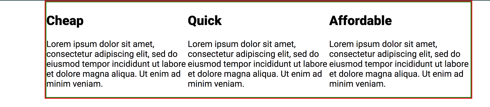
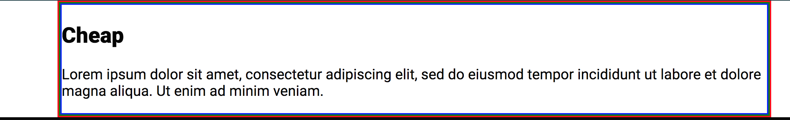

# conquering-responsive-layouts

> Challenge solutions and Notes on [Kevin
> Powell's](https://www.kevinpowell.co/) course [Conquering Responsive
> Layouts](https://courses.kevinpowell.co/courses/conquering-responsive-layouts)

## Using percentages & avoiding heights

- Layouts are responsive by default. A website without CSS is responsive. It's us who ruin the responsiveness of the web.
- Work in percentages for widths.
- Percentage width of an element is always relative to its parent.
- Avoid setting heights.
- If you need more background use `padding`.

## em vs rem

_TL;DR_: In general, `em` should not be used for `font-size`. Use `rem`,
instead. `rem` is also appropriate to space elements between themselves
(`margin`). `em` gives uses consistent, scalable results. A good use case for
`em` is padding, when we would like to have different size versions of an
element.

YouTube video: https://www.youtube.com/watch?v=_-aDOAMmDHI

Source code: https://codepen.io/kevinpowell/pen/RKdjXe

- Pixels are solid units, they never change.
- `em` and `rem` make our lives much easier when it comes to responsive.
- The whole em unit has its background in the print world, but it the world of web it relates just to font sizes
- For `font-size`, `em` looks at its parent's `font-size`. If `font-size` is not defined, it keeps looking up for it until its found.
- For other properties, `em` looks at **that** element's `font-size`.
- Generally, if `font-size` is not changed, `1em` equals to `16px`.
- With `em` the font sizes compound, they build on each other, so things can get out of control.
- `rem` (root em) was invented to fix the compounding problem. Relates to `html`'s `font-size`.
- `rem` units are more consistent.
- These units can be also used in other properties, such as margins and paddings.
- When `em` is used in properties other than `font-size`, it will look at its own `font-size`.

```css
.col--em h1 {
  font-size: 2.5em;
  margin-bottom: 1em;
}
```

- In the example above, `margin-bottom` will be `2.5em`.
- This does not apply to `rem`. `rem` will **always** look to the root.

```css
.col--em h1 {
  font-size: 2.5em;
  margin-bottom: 1rem;
}
```

- In this case, `margin-bottom` will be `16px` (the font size of the `html` element).

How is this useful? (See video @ 8:10s)

- For example, setting `padding` in a `button`.

```css
.btn {
  padding: 1em 3em;
}
```

- Now imagine we want a small button:

```css
.btn-small {
  font-size: 0.5em;
}
```

```html
<a href="#" class="btn btn-small"></a>
```

- Because we are using `em` the `padding` is automatically adjusting to the `font-size`, keeping everything in the same proportion.
- If it was in `rem`, the `padding` would have not changed, only the `font-size`.
- Its useful to use `em` for this kind of situations, where we want something to be _adaptable_ and _scalable_.
- It's a great way of having consistent elements. Just by creating a new class and setting its `font-size`.
- Now, imagine you'd want consistent spacing (`margin`) between the buttons. In that case it would be more appropriate to use `rem`. It's not going to be relative to the button's `font-size`, so it will always be the same.

- Mind-blowing trick with media queries @ 15:08:

```css
html {
  font-size: 16px;
}
@media (min-width: 700px) {
  html {
    font-size: 25px;
  }
}
```

- Everything gets bigger because at one point both `em`s and `rem`s will reach `html` (careful with the compounding effect). With one media query only, all the `font-size`s can be changed. If `px` was being used, it would not be possible to do this.

## max-width

https://css-tricks.com/tale-width-max-width/

- Helps avoiding horizontal scrolling.
- Very useful for big screen sizes, when we want to limit total line lengths, without having text stretching all the way across.
- Combine `width` (%) and `max-width` (px):

```css
.container {
  width: 80%;
  max-width: 750px;
}
```

- It wants to be 80% of its parent, but it will never get bigger than 750px.
- As `height`, in general, `min-width` should also be avoided. They "fight against something to be responsive".

## CSS Units: vh, vw, vmin, vmax

YouTube video: https://www.youtube.com/watch?v=IWFqGsXxJ1E

Source code: https://codepen.io/kevinpowell/pen/QdRyKe

- `vh` and `vw` stand for viewport height and viewport width.
- `height: 100vh` is useful for full-screen, it sets the height to 100% of the height of its viewport.
- Can cause some problems, in smaller screens. Content can _spill out_ of its container if it doesn't fit. Use some media queries to fix that if needed.
- Percentage widths are relative to the parent element. Viewport widths are not. Can be useful when you want to stretch something outside of its container and take up the entire width of the viewport.

- `vmax` is based on the biggest viewport unit (width and height).
- `vmin` is the other way around, it takes the smallest unit.
- Cool trick is having `padding-top` and `padding-bottom` as `10vh`, for example.
- Setting `font-size` of a title with `vw` can be very useful to make them responsive, instead of media queries that change the `font-size` at different sizes. Maybe only for very small and very big screen sizes.
  Doesn't work so good with paragraph text.
- `8vmin` for the `font-size` of a title is also a really cool trick. While the height is smaller than the width (desktop), it will be in relation to the height; when the width becomes smaller (mobile), it will starto to be in relation the width.

## flexbox

- `display:flex` declares a container as a flex container.
- By default, it says "This item is becoming a row" (The default value of `flex-direction` is `row`). This means all its direct children will be columns.
- `flex-direction` can also have the value `column`. In that case, the item is becoming a column and its direct children rows.
- A child of a flex container is called flex item.
- Flex items try to shrink down to the smallest size they can be. For example, by default a `div` has a width of 100%. However, if that div is a flex item and the `flex-direction` of its parent is `row`, it won't _want_ to take 100% anymore.



```css
.container {
  width: 80%;
  max-width: 1100px;
  margin: 0 auto;
  border: 2px solid red;
}

.row {
  /* display: flex => flex container */
  display: flex;
  border: 2px solid green;
}

.col {
  /* these are now flex items */
}
```

- Now, let's try commenting the paragraph of the first flex item:


- As we can see, that item only takes the minimum space it needs.
- Flex items, by default, _want_ to be as small as they can be.

- At the same time, their content (the `<p>` element, to be more specific) is trying to take up 100% of the width. If we comment the last two flex items, leaving only the first, we get:



- The paragraph is forcing the flex item to take 100% of the width.
- When the three flex items are present, all their `<p>` elements are trying to take 100% of the width.
- But, since their parent elements are all flex items of the same flex container, they'll have to fit in the same row.

- We've seen [what happens](#shrink) when one of the flex items has shorter content.
- If you want to make sure they're all the same size, give them `width: 100%`. Because they all want to be 100%, they'll even out and evenly distribute within that space. 100% is the \_ideal" size that they want to be.
